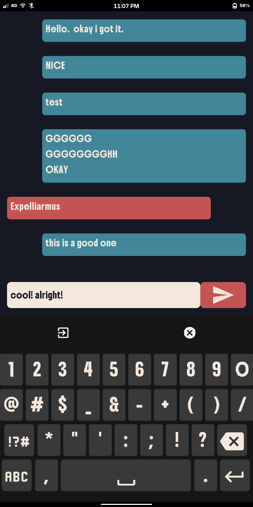
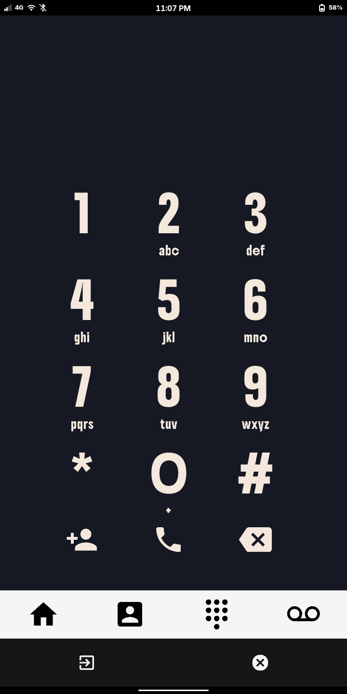
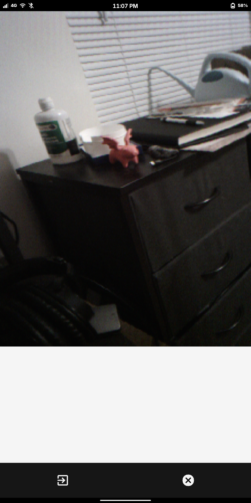

# hackos

A hackable frontend for pinephone - work in progress!

## about

This frontend is run with a [custom build](https://github.com/skinnyjames/hp-pinephone/actions/runs/28134534156) of [hokusai pocket](https://github.com/skinnyjames/hokusai-pocket) which includes modules for Camera input and DBus.

To run it, download the custom hokusai-pocket binary and this repo to your pinephone.

* `hokusai-pocket run:target=hackos.rb`

## how is it hackable?

The hokusai pocket binary evaluates gui applications at runtime.
You can hack on or modify the system by editing the Ruby files.

> [!NOTE]
> It's also possible to fetch remote content with hokusai pocket and create new apps and components
> at runtime.  Totally unsafe, but fun!

## benefits?

hokusai pocket is a binary that produces GPU accelerated GUIs using Raylib (with an SDL3 backend) and MRuby.
The footprint is quite small, making it ideal for embedded devices such as the pinephone.
This programs are very responsive and should be capable of outperforming GTK applications easily.

The goal is to make the pinephone an attractive option as a daily driver.

It's also hackable.

## screenshots?

